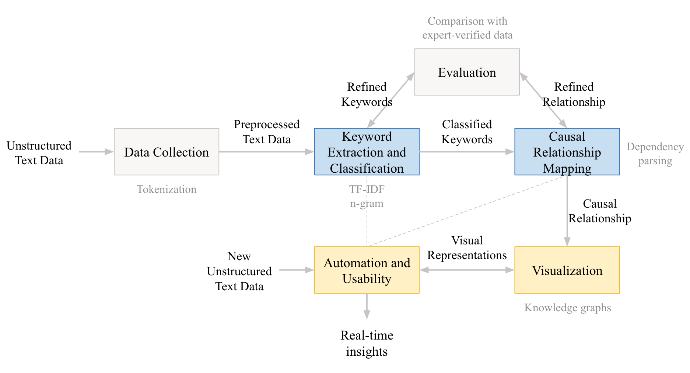

# Inferring-Cause-of-Reactor-Overheat-Issues-Using-NLP
<!-- 
README.md for the project: Inferring Causes of Reactor Overheat Issues Using NLP
GitHub Repository: https://github.com/separk-1/Inferring-Cause-of-Reactor-Overheat-Issues-Using-NLP 
-->

# Automated Keyword Extraction and Causal Relationship Mapping Framework

This project was conducted as part of the **12-746 Fall 2024 Mini 1 class** at **Carnegie Mellon University (CMU)**.

## Overview

This project aims to automate the process of **keyword extraction** and **causal relationship mapping** from unstructured text data. The system leverages **Natural Language Processing (NLP)** techniques to analyze and classify text data, identify causal relationships, and provide real-time insights through visual representations such as **knowledge graphs**.

### Key Components:

1. **Data Collection & Preprocessing**:
   - Unstructured text data is collected and tokenized for further processing.

2. **Keyword Extraction and Classification**:
   - Techniques such as **TF-IDF** and **n-grams** are used to extract and classify relevant keywords.

3. **Causal Relationship Mapping**:
   - Dependency parsing is applied to identify causal relationships between classified keywords.

4. **Evaluation**:
   - The extracted keywords and relationships are evaluated and refined by comparing them with expert-verified data.

5. **Visualization**:
   - The refined causal relationships are visualized using **knowledge graphs**, providing clear and actionable insights.

6. **Automation and Usability**:
   - The system is designed to handle new unstructured data automatically, enabling real-time updates and insights.

## System Flow



The above diagram illustrates the flow of the system, beginning from **data collection** to **visualization**, and shows how **automation** ensures real-time insights.

### Detailed Flow:

- **Data Collection**: Unstructured text is collected and tokenized.
- **Keyword Extraction & Classification**: TF-IDF and n-grams help extract and classify keywords.
- **Causal Relationship Mapping**: Dependency parsing helps create causal relationships.
- **Evaluation**: Refined keywords and relationships are compared with expert data.
- **Visualization**: Knowledge graphs visually represent the data for usability.
- **Automation**: New data is processed in real-time, offering continuous insights.

## Requirements

To set up the project locally, ensure that the following dependencies are installed:

- **Python 3.10+**
- Required Python libraries:
  - `nltk`
  - `spacy`
  - `scikit-learn`
  - `matplotlib`
  - `networkx`

You can install all dependencies with the following command:

```bash
pip install -r requirements.txt
```

## How to Run

<!-- Step-by-step guide for running the project locally -->

1. **Clone the repository**:
   <!-- Clone the project from the GitHub repository using the following command -->
   ```bash
   git clone https://github.com/separk-1/Inferring-Cause-of-Reactor-Overheat-Issues-Using-NLP.git
   cd Inferring-Cause-of-Reactor-Overheat-Issues-Using-NLP
   ```

2. **Install the required packages**:
    <!-- Install the dependencies listed in the `requirements.txt` file -->
    ```bash
    pip install -r requirements.txt
    ```

3. **Run the Jupyter notebook**:
   <!-- Open the `.ipynb` file using Jupyter Notebook or VS Code -->
   - Open the `.ipynb` file with either:
     - **VS Code** with the Jupyter extension installed, or
     - **Jupyter Notebook** by running the following command in the terminal:
       ```bash
       jupyter notebook
       ```

4. **Execute the notebook cells**:
   <!-- Instructions to run the cells in the notebook -->
   - After opening the notebook, execute each cell sequentially to process the data and visualize the results.

5. **For script execution (optional)**:
   <!-- Instructions for running the Python script, if available -->
   - If a Python script is provided in the repository, you can run it directly in the terminal:
     ```bash
     python script_name.py
     ```